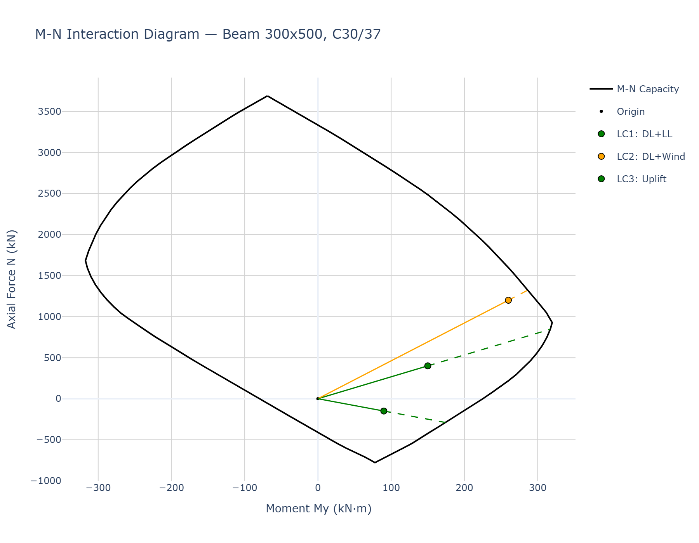
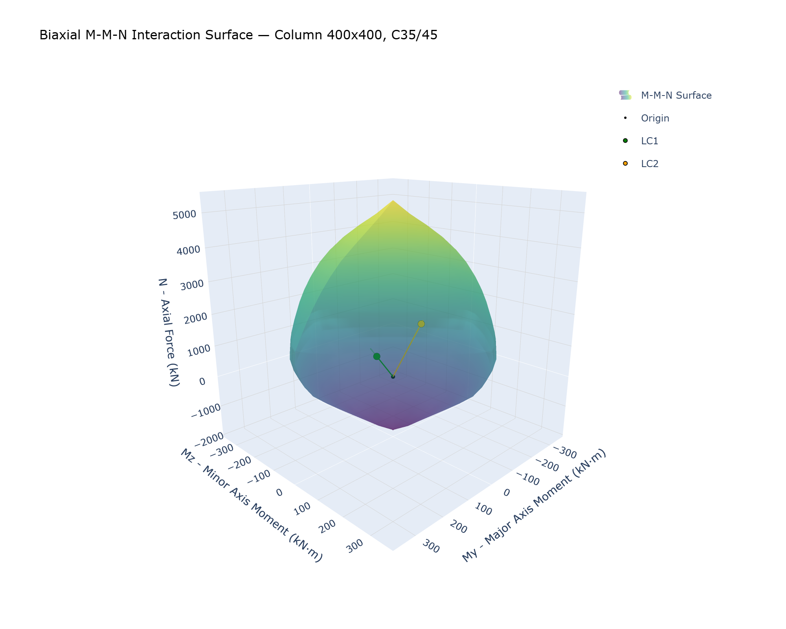
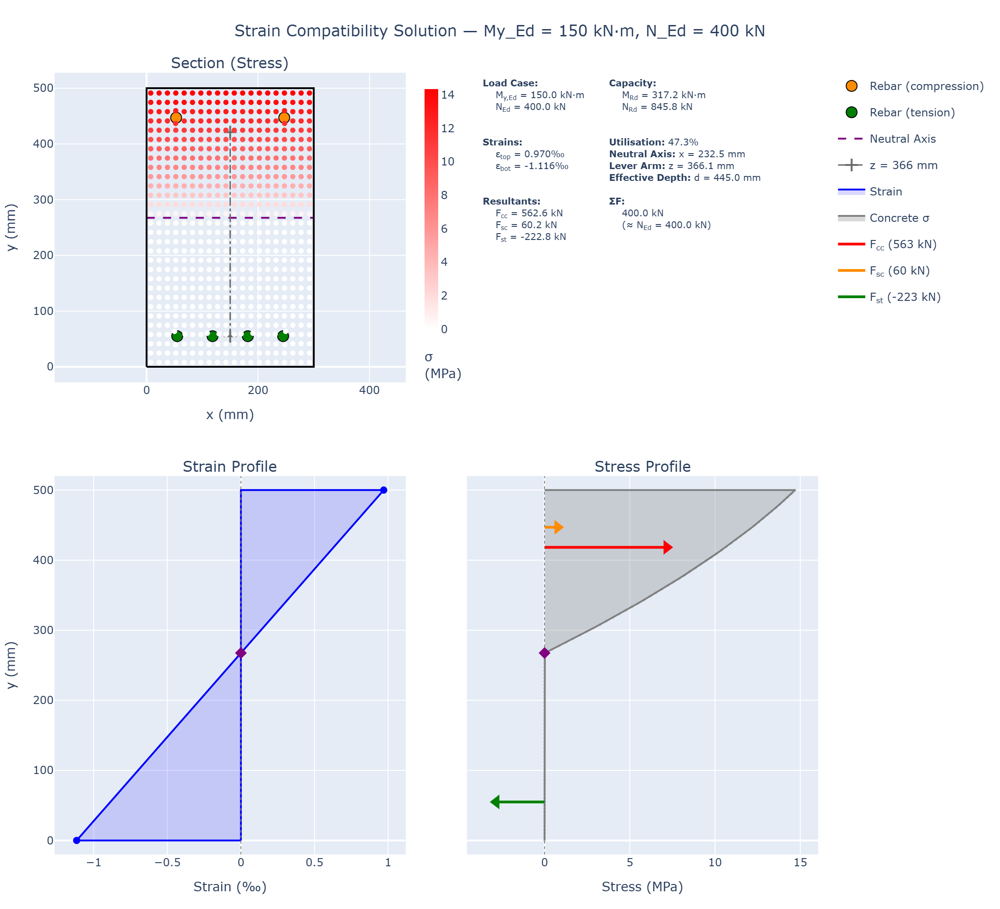
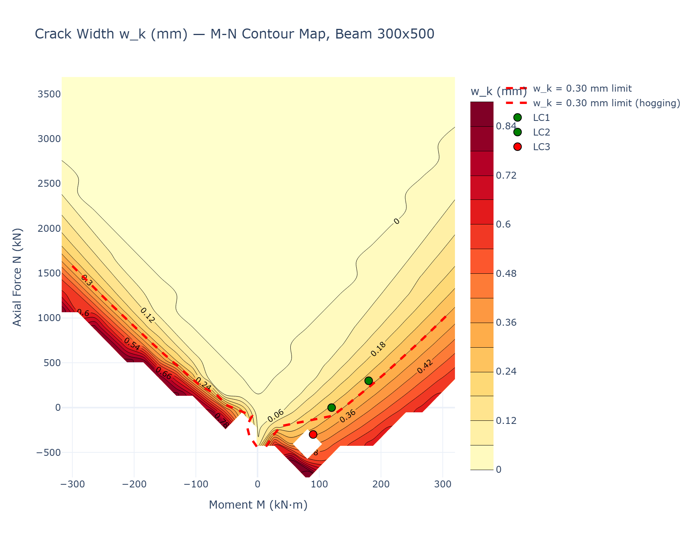
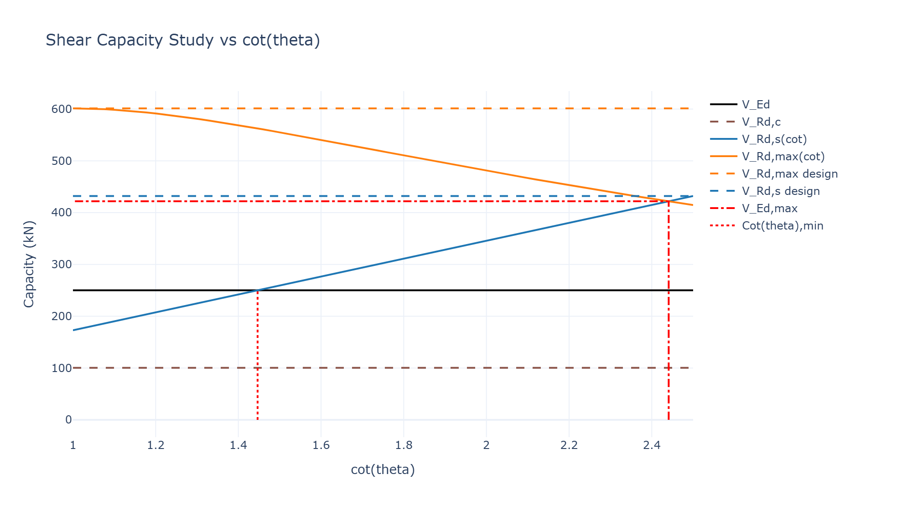
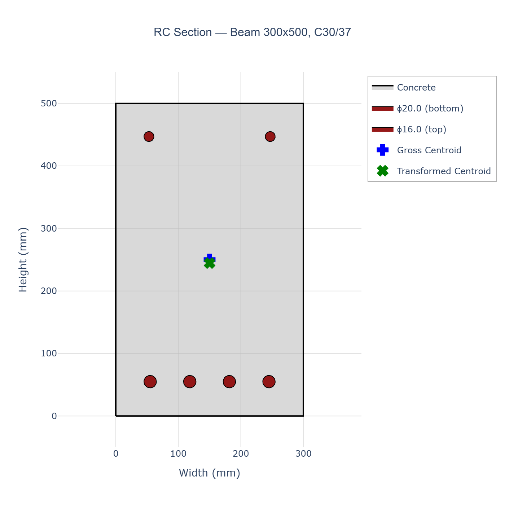

# Section Design Checks

[](https://github.com/jsb2505/section_design_checks/actions/workflows/ci.yml)
[](https://www.python.org/downloads/)
[](LICENSE)

A Python library for reinforced concrete section analysis and design checks to
Eurocode 2 (EN 1992-1-1:2004). It combines a fibre-based strain-compatibility
engine with fully validated Pydantic models, so the same code that drives an
interactive design study can sit behind an API or post-process FEA results in
batch.

## Gallery

| | |
|---|---|
|  |  |
| *Uniaxial M-N interaction diagram with load cases and capacity vectors* | *Biaxial M-M-N interaction surface (EC2 pivot method)* |
|  |  |
| *Strain-compatibility solution for an applied (M, N) pair* | *SLS crack width contour map over the M-N domain* |
|  |  |
| *Variable strut inclination study for the shear check* | *Section viewer with rebar hover data* |

All plots are interactive Plotly figures; the PNGs above are regenerated with
[examples/generate_release_plots.py](examples/generate_release_plots.py).

## Features

**Materials and constitutive models**
- EC2 concrete grades C12/15 to C90/105 and reinforcement B500A/B/C, with
  partial factors, long-term coefficients and derived properties computed and
  validated by Pydantic
- EC2 stress-strain models: parabola-rectangle, bilinear, schematic and
  linear-elastic (SLS), steel with horizontal or inclined post-yield branch,
  plus confined-concrete and user-defined constitutive models
- Concrete ageing (strength development with time) and early-age thermal
  models (adiabatic temperature rise to CIRIA C766)

**Section geometry**
- Arbitrary polygonal outlines (including holes) built on Shapely, with
  helpers for rectangular and circular sections, linear rebar layers and
  perimeter bar arrangements
- Fibre mesh generation for strain-compatibility analysis of any shape
- Save/load of complete reinforced sections to JSON

**Section analysis**
- Uniaxial M-N interaction diagrams from first principles (fibre integration
  with analytical Jacobians, cached inverse solver, parallel batch solving)
- Biaxial M-M-N interaction surfaces generated with the EC2 pivot method, so
  every point lies on the true failure surface
- Inverse strain solver: given (M, N) find the strain plane, then reuse it for
  effective depth, lever arm and stress extraction
- Free neutral-axis adapter for unsymmetric sections and biaxial SLS states,
  including an analytical fast path for uncracked linear-elastic states

**Code checks (EN 1992-1-1:2004)**
- Bending with axial force, via the interaction diagram (`BendingCheck`)
- Shear to section 6.2 with variable strut inclination, tension shift,
  uncracked shear capacity and axial-force effects (`ShearCheck`)
- Crack width to section 7.3 (`CrackingCheck`) and stress limits to
  section 7.2 (`StressLimitsCheck`)
- Combined beam checks (`BeamCheck`) orchestrating the above
- Circular sections (piles, columns) following Orr (2012), with shear
  efficiency factors, equivalent web width and the k_f factor for cast-in-place
  piles (`CircularSectionCheck`)

**Nationally Determined Parameters**
- NDP registry for EN 1992-1-1:2004 and EN 1992-2:2005 with the EU recommended
  values plus UK and German National Annexes, switchable at runtime and
  extensible with custom annexes

**Visualisation**
- Interactive Plotly viewers for sections, M-N diagrams (with load points and
  utilisation vectors), 3D biaxial surfaces, strain/stress states, shear
  design studies (cot θ, link angle, heatmaps, contour maps with sliders) and
  crack widths (3D stem plots and M-N contour maps)

## Installation

```bash
git clone https://github.com/jsb2505/section_design_checks.git
cd section_design_checks
pip install -e ".[viz]"        # viz extra adds Plotly
```

Requires Python 3.11+. Core dependencies: Pydantic v2, NumPy, SciPy, Shapely.
For static image export of the Plotly figures, additionally `pip install kaleido`.

## Quick start

```python
from materials.reinforced_concrete.materials import ConcreteMaterial, Rebar, ShearRebar
from materials.reinforced_concrete.geometry import (
    create_rectangular_section,
    create_linear_rebar_layer,
)
from materials.reinforced_concrete.analysis import create_interaction_diagram
from materials.reinforced_concrete.code_checks.ec2_2004 import (
    CrackingCheck,
    LoadCase,
    ShearCheck,
)

# 300x500 beam, C30/37, 4H20 bottom + 2H16 top
concrete = ConcreteMaterial(grade="C30/37")
section = create_rectangular_section(width=300, height=500)
section.add_rebar_group(
    create_linear_rebar_layer(
        rebar=Rebar(diameter=20, grade="B500B"),
        n_bars=4,
        start_point=(60, 60),
        end_point=(240, 60),
    )
)
section.add_rebar_group(
    create_linear_rebar_layer(
        rebar=Rebar(diameter=16, grade="B500B"),
        n_bars=2,
        start_point=(60, 440),
        end_point=(240, 440),
    )
)

# ULS bending capacity from the M-N interaction diagram
diagram = create_interaction_diagram(section=section, concrete=concrete)
capacity = diagram.get_capacity_vector(N_Ed=400.0, M_Ed=150.0)
print(f"Utilisation: {capacity.utilization:.2f} (safe: {capacity.is_safe})")

# Shear check to EC2 6.2 (variable strut inclination)
shear = ShearCheck(
    section=section,
    concrete=concrete,
    shear_reinforcement=ShearRebar(diameter=10, link_spacing=150, n_legs=2, grade="B500B"),
)
result = shear.perform_check(load_case=LoadCase(V_Ed=250.0, M_Ed=100.0, N_Ed=150.0))
print(result)

# SLS crack width to EC2 7.3
cracking = CrackingCheck(section=section, concrete=concrete, w_k_limit=0.3)
crack = cracking.calculate_detailed(My_Ed=120.0, N_Ed=0.0)
print(f"w_k = {crack.w_k:.3f} mm (limit {crack.w_k_limit} mm)")
```

### Biaxial bending

```python
from materials.reinforced_concrete.analysis.biaxial_interaction import (
    BiaxialMNInteractionSurface,
)

surface = BiaxialMNInteractionSurface(section=section, concrete=concrete)
N_Rd, My_Rd, Mz_Rd, is_safe, utilisation = surface.get_capacity_vector(
    N_Ed=1000.0, My_Ed=150.0, Mz_Ed=60.0
)

# Interactive 3D surface with load points and capacity vectors
surface.plot(
    load_points=[{"N_Ed": 1000, "My_Ed": 150, "Mz_Ed": 60, "name": "LC1"}],
    show_vectors=True,
)
```

### National Annexes

```python
from materials.reinforced_concrete.ndp import CountryCode, set_ndp_context

set_ndp_context(country=CountryCode.EU_UK)   # UK National Annex
set_ndp_context(country=CountryCode.EU_DE)   # German National Annex
set_ndp_context(country=CountryCode.EU)      # EC2 recommended values (default)
```

## Units and sign conventions

- Dimensions in **mm**, forces in **kN**, moments in **kN·m**, stresses in **MPa**
- Axial force `N_Ed` is **compression positive**
- `My_Ed` is the major-axis moment, `Mz_Ed` the minor-axis moment;
  `Vz_Ed` is the major-axis (vertical) shear paired with `My_Ed`, and `Vy_Ed`
  the minor-axis (horizontal) shear paired with `Mz_Ed`
- `V_Ed` and `M_Ed` are accepted as direction-agnostic inputs that map to the
  major axis

## Examples

The [examples/](examples/) directory contains runnable scripts and Jupyter
notebooks, including:

| Notebook | Topic |
|---|---|
| [m_n_interaction_diagram_tutorial.ipynb](examples/m_n_interaction_diagram_tutorial.ipynb) | Uniaxial M-N diagrams end to end |
| [biaxial_mn_interaction_tutorial.ipynb](examples/biaxial_mn_interaction_tutorial.ipynb) | Biaxial M-M-N surfaces and the pivot method |
| [ec2_code_checks_demonstration.ipynb](examples/ec2_code_checks_demonstration.ipynb) | Bending, shear, cracking and stress-limit checks |
| [shear_viewer_demonstration.ipynb](examples/shear_viewer_demonstration.ipynb) | Shear design study plots |
| [crack_width_viewer_demonstration.ipynb](examples/crack_width_viewer_demonstration.ipynb) | Crack width visualisation |
| [circular_section_check_demonstration.ipynb](examples/circular_section_check_demonstration.ipynb) | Circular pile/column checks (Orr 2012) |
| [ndp_demonstration.ipynb](examples/ndp_demonstration.ipynb) | Nationally Determined Parameters |

## Testing and code quality

- 1,300+ tests run in CI on every push (fast lane plus a slow biaxial
  regression lane)
- `ruff` linting and a fully type-checked codebase under `mypy` (both blocking
  in CI)
- Numerical results are validated against hand calculations and published
  references throughout the test suite

```bash
pip install -e ".[dev,viz]"
pytest                # fast lane
pytest -m slow        # slow lane (biaxial surface regression)
```

## Project structure

```
materials/
├── core/                        # Base abstractions: materials, constitutive, units
└── reinforced_concrete/
    ├── materials/               # Concrete, rebar, ageing
    ├── constitutive/            # EC2 stress-strain models
    ├── geometry/                # Sections, rebar layers, fibre mesh, viewer
    ├── analysis/                # M-N diagrams, biaxial surfaces, viewers
    ├── code_checks/ec2_2004/    # Bending, shear, cracking, stress limits, circular
    ├── ndp/                     # Nationally Determined Parameters (EU, UK, DE)
    └── thermal/                 # Early-age thermal models (CIRIA C766)
```

## Disclaimer

This library is provided for research and engineering workflow automation.
It is **not** a substitute for professional engineering judgement: all results
must be independently verified by a qualified engineer before being used in
design. See the [LICENSE](LICENSE) for the full warranty disclaimer.

## Contributing

Issues and pull requests are welcome. Please run the test suite and the
`ruff`/`mypy` gates before submitting:

```bash
ruff check materials tests --extend-ignore E501
mypy materials --ignore-missing-imports
pytest
```

## References

- EN 1992-1-1:2004 — Eurocode 2: Design of concrete structures, Part 1-1
- EN 1992-2:2005 — Eurocode 2: Concrete bridges
- Orr, J. J. (2012). *Shear design of circular concrete sections.* University of Bath
- CIRIA C766 — Control of cracking caused by restrained deformation in concrete

## Licence

[MIT](LICENSE)
